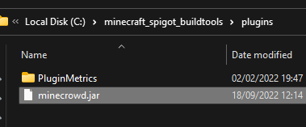
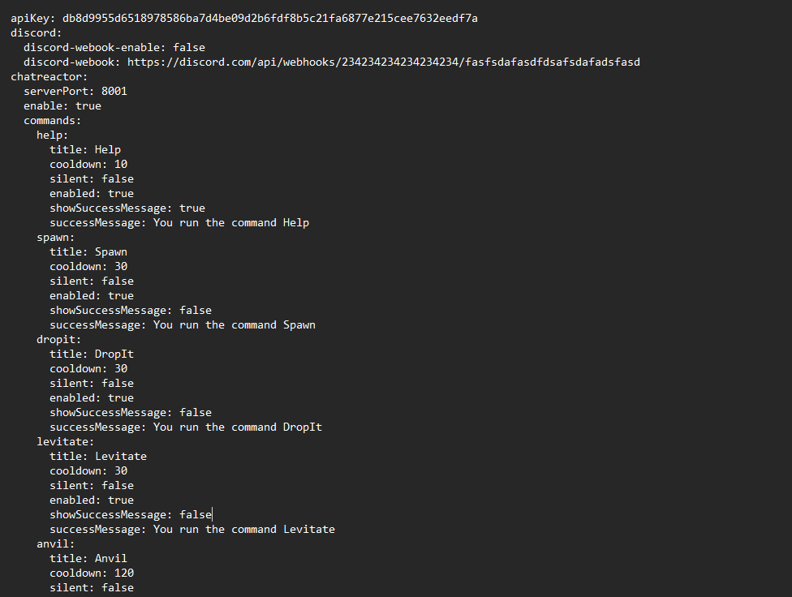

# Welcome to MineCrowd
This plugin aims to be a fun way to make the chat interact (or more likely mess up) with the streamer directly in game.

## Install
To install this plugin just download "minecrowd.jar" file and drop it directly in the server "plugins" folder.

At the first start the plugin will create a configuration file with all the settins/options that you may need.

Open the file and look for the first row named "ApiKey" this key has been generated by the script and 

**SHOULD NOT BE SHARED WITH ANYBODY, LET ALONE THE CHAT**

This key will be useful in any chatbot like StreamElements to be able to interact with the server

## StreamElements custom command setup:

`${urlfetch http://<server_ip_address>:<server_port>/command?apiKey=<config_apiKey>&name=${user}&command=${1}&options=${2:|'cat'}}`

**Remember to replace**

**<server_ip_address>** with your personal server address (i.e. mine.stubfx.com)

**<server_port>** with your custom server port (default 8001)

**<config_apiKey>** with your apiKey found in the plugin config

## Plugin configuration

The plugin configuration is quite straightforward, for each command you have 6 different parameters:

- Title (default - name of the command)
  - Title of the command that will be shown on screen when the command has run **if silent is false** (default for most commands).
- Cooldown (default - 30 seconds for most commands)
  - Cooldown of the command in seconds
- Silent (default - false for most commands)
  - If true the command won't be shown on screen, this is useful for command such as "PanicSound" as it won't be shown to the player (so it has a better jumpscare effect)
- Enabled (default - true)
  - Well, yes.
- showSuccessMessage (default - false)
  - If true will return to the caller (chatbot usually) the success message. Is recommended to leave it to false as it makes the chat quite messy.
- successMessage (default - You run the command ...)